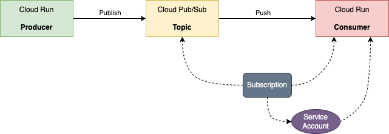

# Cloud Run Service Triggered Another Service using Pub/Sub

## Usecase

The **`ProducerService`** publishes a message on a Pub/Sub topic where a subscription pushes the message to the **`ConsumerService`**.




## Key Points

1. Invoking Cloud Run services via Pub/Sub subscriptions
2. IAM service account and role binding

## Environment Variables

```bash
GOOGLE_CLOUD_PROJECT=ibcwe-event-layer-f3ccf6d9
REPOSITORY=us-central1-docker.pkg.dev/$GOOGLE_CLOUD_PROJECT/cloud-run-try
TOPIC=py-test
```

## Build

### Producer

```bash
gcloud builds submit --tag $REPOSITORY/producer
```

### Consumer

```bash
gcloud builds submit --tag $REPOSITORY/consumer
```

## Deployment

### Enabling APIs

```bash
gcloud services enable run.googleapis.com
gcloud services enable pubsub.googleapis.com
```

### Producer Services

```bash
gcloud run deploy producer-service --image $REPOSITORY/producer \
--set-env-vars GOOGLE_PROJECT_ID=$GOOGLE_CLOUD_PROJECT --set-env-vars TOPIC=$TOPIC
```

### Consumer Service

```bash
gcloud run deploy consumer-service --image $REPOSITORY/consumer 
```

### Service Account

```bash
gcloud iam service-accounts create async-cloud-run --display-name "async-producer"
```

#### Role Binding
```bash
gcloud run services add-iam-policy-binding consumer-service \
--member=serviceAccount:async-cloud-run@$GOOGLE_CLOUD_PROJECT.iam.gserviceaccount.com \
--role=roles/run.invoker
```

#### Enable project's Pub/Sub service agent to create access tokens
```bash
PROJECT_NUMBER=$(gcloud projects list \
--filter="ibcwe-event-layer" \
--format='value(PROJECT_NUMBER)')

gcloud projects add-iam-policy-binding $GOOGLE_CLOUD_PROJECT \
--member=serviceAccount:service-$PROJECT_NUMBER@gcp-sa-pubsub.iam.gserviceaccount.com \
--role=roles/iam.serviceAccountTokenCreator
```

### Pub/Sub

#### Topic
```bash
gcloud pubsub topics create $TOPIC
```

#### Subscription
```bash
CONSUMER_SERVICE_URL=$(gcloud run services describe consumer-service \
--format="value(status.address.url)")

echo $CONSUMER_SERVICE_URL

gcloud pubsub subscriptions create consumer-service-sub \
--topic $TOPIC \
--push-endpoint=$CONSUMER_SERVICE_URL \
--push-auth-service-account=async-cloud-run@$GOOGLE_CLOUD_PROJECT.iam.gserviceaccount.com
```

## Testing

### Publish a message
```bash
PRODUCER_URL=$(gcloud run services describe producer-service \
--format="value(status.address.url)")

curl -H "Authorization: Bearer $(gcloud auth print-identity-token)" $PRODUCER_URL
```
The output should be like this:
```text
Published a message; msg ID: 8143517322974721; msg: request-kuaWD
```

Go to Google Cloud Console, and check the logs the `consumer-service`, you should find an entry like `received: request-kuaWD`.

## Clean up

```bash
gcloud run services delete producer-service

gcloud run services delete consumer-service

gcloud iam service-accounts delete async-cloud-run@$GOOGLE_CLOUD_PROJECT.iam.gserviceaccount.com

gcloud pubsub subscriptions delete consumer-service-sub

gcloud pubsub topics delete $TOPIC

gcloud artifacts packages delete producer --repository=cloud-run-try \
--location=us-central1 

gcloud artifacts packages delete consumer --repository=cloud-run-try \
--location=us-central1 
```
<style>
    h1 {
        color: DarkRed;
        text-align: center;
    }
    h2 {
        color: DarkBlue;
    }
    h3 {
        color: DarkGreen;
    }
    h4 {
        color: DarkMagenta;
    }
    strong {
        color: Maroon;
    }
    em {
        color: Maroon;
    }
    img {
        display: block;
        margin-left: auto;
        margin-right: auto
    }
    code {
        color: SlateBlue;
    }
    mark {
        background-color:GoldenRod;
    }
</style>