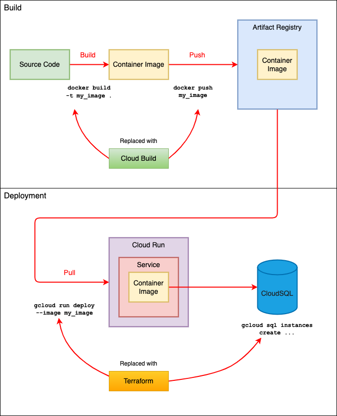

# Employee API - a POC on Google Cloud Run and Terraform

## Purpose

- This POC is to explore how Google Cloud Run can be used as a solution for some simple microservices. 

- Terraform is used to deploy all the required resources to support the idea of infrastructure as code.

- The application exposes an `employee` API endpoint which provides CRUD operations on the Employee resource.



## Local testing

Only Docker engine is required. Just run the following command:
```bash
docker-compose up
```

## Build and Deployment Prerequisites 

1. Enable Artifact Registry in your project
	```bash
	gcloud services enable artifactregistry.googleapis.com
	```

2. Enable CloudSQL APIs
	```bash
	gcloud services enable sqladmin.googleapis.com
	gcloud services enable sql-component.googleapis.com
	```

3. Create a repository named `cloud-run-try` on `us-central1`. 
	```bash
	gcloud artifacts repositories create \
	--location us-central1 \
	--repository-format docker \
	cloud-run-try
	```

## Build

### Manual Build

1. Build the docker image.
	```bash
	docker build -t \
	us-central1-docker.pkg.dev/ibcwe-event-layer-f3ccf6d9/cloud-run-try/employee .
	```
2. Set up credentials to access the repo
	```bash
	gcloud auth configure-docker us-central1-docker.pkg.dev
	```
3. Push the image
	```bash
	docker push \
	us-central1-docker.pkg.dev/ibcwe-event-layer-f3ccf6d9/cloud-run-try/employee
	```
4. Verify the image is built and pushed successfully
	```bash
	gcloud run services list
	```

### Cloud Build

```bash
gcloud builds submit --tag us-central1-docker.pkg.dev/ibcwe-event-layer-f3ccf6d9/cloud-run-try/employee2
```

## Deployment

### Manual deployment

#### CloudSQL database

1. Create a Cloud SQL instance named `sql-db`
	```bash
	gcloud sql instances create sql-db \
	--tier db-f1-micro \
	--database-version MYSQL_8_0 \
	--region us-central1
	```
2. Create the `hr` database
	```bash
	gcloud sql databases create hr --instance sql-db
	```

#### Cloud Run service

1. Deploy
	```bash
	gcloud run deploy employee-api \
	--image us-central1-docker.pkg.dev/ibcwe-event-layer-f3ccf6d9/cloud-run-try/employee \
	--allow-unauthenticated
	```
2. Check the service is deployed successfully
	```bash
	gcloud run service list
	```

### Deploying with Terraform

1. Initialization
	```bash
	cd td
	terraform init
	```
2. Creating a plan
	```bash
	terraform plan -out tfplan
	```
3. Applying the plan
	```bash
	terraform apply
	```

## Testing

### Table Preparation

1. Install cloud sql proxy
	```bash
	curl -o cloud-sql-proxy https://storage.googleapis.com/cloud-sql-connectors/cloud-sql-proxy/v2.4.0/cloud-sql-proxy.linux.amd64
	chmod +x cloud-sql-proxy
	sudo mv cloud-sql-proxy /usr/local/bin 
	```
2. Install MySQL Client
	```bash
	sudo apt-get install mysql-client
	```
3. Get the instance connection name
	```bash
	gcloud sql instances describe sql-db|grep -i connection | awk '{print $2}'
	```
4. Start the cloud sql proxy to connect to `sql-db`
	```bash
	cloud-sql-proxy --port 3306 ibcwe-event-layer-f3ccf6d9:us-central1:sql-db
	```
5. Create and populate the `employees` table
	```bash
	mysql -u root -p --host 127.0.0.1 hr < schema.sql
	```

### Cloud Run service endpoint

Get the service endpoint using the following command:

```bash
$ gcloud run services list
   SERVICE       REGION       URL   
✔  employee-api  us-central1  https://employee-api-oy6beuif2a-uc.a.run.app  
```

### Hit the endpoint

```bash
curl -H "Authorization: Bearer $(gcloud auth print-identity-token)" \
https://employee-api-oy6beuif2a-uc.a.run.app/api/employee
```

## Cleanup

### Manual cleanup

1. Delete the Cloud Run service
	```bash
	gcloud run services delete employee-api
	```
2. Remove the Cloud SQL instance
	```bash
	gcloud sql instances delete sql-db
	```
3. Delete docker images (packages) in the Artifact Registry repository
	```bash
	# list all packages in the repo
	gcloud artifacts packages list --repository=cloud-run-try --location=us-central1

	# delete the package
	gcloud artifacts packages delete employee --repository=cloud-run-try --location=us-central1
	```

### Cleanup with Terraform

1. Delete all the resources
	```bash
	cd tf
	terraform destroy
	```

2. Delete docker images (packages) in the Artifact Registry repository: same as above
