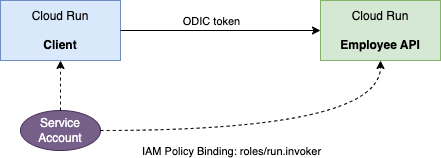

# Service-to-Service Authentication



- Employee API only accepts requests from a specific service account.

- The client must present a valid ODIC token when calling the API. The client does this by calling the local metadata server using GCP client library.

1. Deploy the API
    ```bash
    gcloud run deploy employee-api \
    --image \
    us-central1-docker.pkg.dev/ibcwe-event-layer-f3ccf6d9/cloud-run-try/employee
    ```
2. Create a new service account `emp-api-client`
    ```bash
    gcloud iam service-accounts create emp-api-client
    ```
2. Bind the new service account as the Cloud Run Invoker of the API
    ```bash
    gcloud run services add-iam-policy-binding employee-api \
    --member=serviceAccount:emp-api-client@ibcwe-event-layer-f3ccf6d9.iam.gserviceaccount.com \
    --role=roles/run.invoker
    ```
3. Deploy the client (bad version) and specify the service account 
    ```bash
    gcloud run deploy client --image \
    us-central1-docker.pkg.dev/ibcwe-event-layer-f3ccf6d9/cloud-run-try/client:bad \
    --set-env-vars EMPLOYEE_API=https://employee-api-oy6beuif2a-uc.a.run.app \
    --service-account \
    emp-api-client@ibcwe-event-layer-f3ccf6d9.iam.gserviceaccount.com
    ```
4. Test: call Client which will call the API
    ```bash
    curl -H "Authorization: Bearer $(gcloud auth print-identity-token)" https://client-oy6beuif2a-uc.a.run.app
    ```
    And we get:
    ```text
    <html><head>
    <meta http-equiv="content-type" content="text/html;charset=utf-8">
    <title>403 Forbidden</title>
    </head>
    <body text=#000000 bgcolor=#ffffff>
    <h1>Error: Forbidden</h1>
    <h2>Your client does not have permission to get URL <code>/api/help</code> from this server.</h2>
    <h2></h2>
    </body></html>
    ```
5. Now redeploy the client with the good image
    ```bash
    gcloud run deploy client --image \
    us-central1-docker.pkg.dev/ibcwe-event-layer-f3ccf6d9/cloud-run-try/client \
    --set-env-vars EMPLOYEE_API=https://employee-api-oy6beuif2a-uc.a.run.app \
    --service-account \
    emp-api-client@ibcwe-event-layer-f3ccf6d9.iam.gserviceaccount.com
    ```
6. Test again and the call to the API from the client will succeed.
    ```bash
    curl -H "Authorization: Bearer $(gcloud auth print-identity-token)" https://client-oy6beuif2a-uc.a.run.app
    ```
    ```text
    Employee API v1
    ```