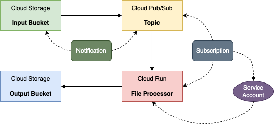

# Cloud Run Service Triggered by a Cloud Storage Event

## Usecase

Move files arriving at one storage bucket to another bucket.



The File Processor application will run on Cloud Run.

## Key POC Points:
1. Cloud Build to build container image
2. Pub/Sub notifications for Cloud Storage
3. Invoking Cloud Run services via events
4. IAM service account and role binding

## Environment Variables

```bash
GOOGLE_CLOUD_PROJECT=ibcwe-event-layer-f3ccf6d9
REPOSITORY=us-central1-docker.pkg.dev/$GOOGLE_CLOUD_PROJECT/cloud-run-try
```

## Build the Container Image using Cloud Build

```bash
gcloud builds submit --tag $REPOSITORY/event
```

## Create Google Cloud Resources

### Cloud Storage Buckets

```bash
gsutil mb gs://$GOOGLE_CLOUD_PROJECT-input
gsutil mb gs://$GOOGLE_CLOUD_PROJECT-output
```

### Deploy the File Processor as a Cloud Run Service `event`

```bash
gcloud run deploy event \
--image $REPOSITORY/event \
--set-env-vars OUT_BUCKET=$GOOGLE_CLOUD_PROJECT-output
```

### Pub/Sub Notification for Cloud Storage

```bash
gsutil notification create -f json -t new-doc -e OBJECT_FINALIZE \
gs://$GOOGLE_CLOUD_PROJECT-input
```

- Message format is json
- Pub/Sub topic name is `new-doc`
- Event type: An object has been created

### Service Account to Trigger the Cloud Run Service

#### Create the Service Account
```bash
gcloud iam service-accounts create pubsub-cloud-run-invoker \
--display-name "PubSub Cloud Run Invoker"
```

#### Role binding

```bash
gcloud run services add-iam-policy-binding event \
--member=serviceAccount:pubsub-cloud-run-invoker@$GOOGLE_CLOUD_PROJECT.iam.gserviceaccount.com \
--role=roles/run.invoker
```

### Grant Project's Pub/Sub Service Agent the Token Creator Role

```bash
PROJECT_NUMBER=$(gcloud projects list \
--format="value(PROJECT_NUMBER)" \
--filter="ibcwe-event-layer")

gcloud projects add-iam-policy-binding $GOOGLE_CLOUD_PROJECT \
--member=serviceAccount:service-$PROJECT_NUMBER@gcp-sa-pubsub.iam.gserviceaccount.com \
--role=roles/iam.serviceAccountTokenCreator
```

### Cloud Storage Trigger - Subscription

```bash
SERVICE_URL=$(gcloud run services describe event \
--platform managed \
--format "value(status.url)")

gcloud pubsub subscriptions create file-processor-sub \
--topic new-doc \
--push-endpoint=$SERVICE_URL \
--push-auth-service-account=pubsub-cloud-run-invoker@$GOOGLE_CLOUD_PROJECT.iam.gserviceaccount.com
```

## Testing

### Cloud Run Service

```bash
curl -X GET -H "Authorization: Bearer $(gcloud auth print-identity-token)" \
$SERVICE_URL
```

This should return a message "I am ready to process POST requests from bucket trigger".

### Cloud Storage Trigger

```bash
gsutil -m cp test_file gs://$GOOGLE_CLOUD_PROJECT-input
```

Verify `test_file` is moved to gs://$GOOGLE_CLOUD_PROJECT-output bucket.

## Cleanup

```bash
gsutil rb gs://$GOOGLE_CLOUD_PROJECT-input
gsutil rb gs://$GOOGLE_CLOUD_PROJECT-output
gcloud run services delete event
gcloud iam service-accounts delete pubsub-cloud-run-invoker@$GOOGLE_CLOUD_PROJECT.iam.gserviceaccount.com
gcloud pubsub topics delete new-doc
gcloud pubsub subscriptions delete file-processor-sub
gcloud artifacts docker images delete  $REPOSITORY/event
```

<style>
    h1 {
        color: DarkRed;
        text-align: center;
    }
    h2 {
        color: DarkBlue;
    }
    h3 {
        color: DarkGreen;
    }
    h4 {
        color: DarkMagenta;
    }
    strong {
        color: Maroon;
    }
    em {
        color: Maroon;
    }
    img {
        display: block;
        margin-left: auto;
        margin-right: auto
    }
    code {
        color: SlateBlue;
    }
    mark {
        background-color:GoldenRod;
    }
</style>