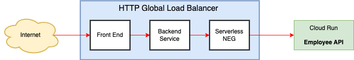

# Using a HTTP Global Loadbalancer 

## Use Case

Set up and use an HTTP global load balancer with Employee API. 



This might be a candidate for any customers applications.

## Environment Variables

```bash
GOOGLE_CLOUD_PROJECT=ibcwe-event-layer-f3ccf6d9
REPOSITORY=us-central1-docker.pkg.dev/$GOOGLE_CLOUD_PROJECT/cloud-run-try
```

## Deploy Employee API on Two Regions

UC1:
```bash
gcloud run deploy employee-api --image $REPOSITORY/employee:v1 \
--region us-central1
```

UE4:
```bash
gcloud run deploy employee-api --image $REPOSITORY/employee:v2 \
--region us-east4
```

Notice that the endpoints are different:
```bash
gcloud run services list |grep employee
```
```text
✔  employee-api  us-central1  https://employee-api-oy6beuif2a-uc.a.run.app  philip.yang@scotiabank.com  2023-08-11T21:19:52.128030Z
✔  employee-api  us-east4     https://employee-api-oy6beuif2a-uk.a.run.app  philip.yang@scotiabank.com  2023-08-11T21:22:03.031706Z
```

For demo purposes, I deploy a different image on each region.

The `/api/help` of UC1 will return `Employee API v1` while UE4 will return `Employee API v2`.

## Reserve an External IP Address

```bash
gcloud compute addresses create employee-ip --ip-version=IPV4 --global
```

Obtain the IP address
```bash
gcloud compute addresses describe employee-ip --format="get(address)" --global
```

```text
34.36.191.224
```

## Create Two Serverless Network Endpoint Groups (NEG)

```bash
gcloud compute network-endpoint-groups create empneg-uc1 --region=us-central1 \
--network-endpoint-type=serverless --cloud-run-service=employee-api

gcloud compute network-endpoint-groups create empneg-ue4 --region=us-east4 \
--network-endpoint-type=serverless  --cloud-run-service=employee-api
```

## Create a Backend Service

```bash
gcloud compute backend-services create empbackendservice --global \
--session-affinity=NONE \
--no-cache-key-include-host \
--no-cache-key-include-query-string
```

## Add the NEGs to the Backend Service

```bash
gcloud compute backend-services add-backend empbackendservice \
--global \
--network-endpoint-group=empneg-uc1 \
--network-endpoint-group-region=us-central1
```

```bash
gcloud compute backend-services add-backend empbackendservice \
--global \
--network-endpoint-group=empneg-ue4 \
--network-endpoint-group-region=us-east4
```

## Create a URL Map to Route Requests to the Backend

```bash
gcloud compute url-maps create empurlmap \
--default-service empbackendservice
```

## Create a HTTP(S) Proxy to Route Requests to the URL map:

```bash
gcloud compute target-http-proxies create emptargetproxy \
--url-map=empurlmap
```

## Create a Global Forwarding Rule to Route Requests to the Proxy:

```bash
gcloud compute forwarding-rules create empforwardingrule \
--address=employee-ip \
--target-http-proxy=emptargetproxy \
--global \
--ports=80
```

## Test

```bash
for i in {1..10}; \
do curl -H "Authorization: Bearer $(gcloud auth print-identity-token)" \
http://34.36.191.224/api/help; \
done
```
The output is 
```text
Employee API v1 
Employee API v1 
Employee API v1 
Employee API v1 
Employee API v1 
Employee API v1 
Employee API v1 
Employee API v1 
Employee API v1 
Employee API v1
```

<style>
    h1 {
        color: DarkRed;
        text-align: center;
    }
    h2 {
        color: DarkBlue;
    }
    h3 {
        color: DarkGreen;
    }
    h4 {
        color: DarkMagenta;
    }
    strong {
        color: Maroon;
    }
    em {
        color: Maroon;
    }
    img {
        display: block;
        margin-left: auto;
        margin-right: auto
    }
    code {
        color: SlateBlue;
    }
    mark {
        background-color:GoldenRod;
    }
</style>