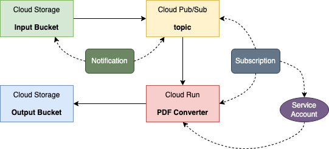

# Cloud Run Service Triggered by Pub/Sub

## Usecase

To convert documents arriving at a Cloud Storage bucket into PDF files and save the output into another storage bucket.


The PDF Converter application will run on Cloud Run.

This is based on Google's [Pet Theory Quest](https://github.com/Deleplace/pet-theory) 

## Key Technology

1. Cloud Build to build container image
2. Pub/Sub notifications for Cloud Storage
3. Invoking Cloud Run services via events
4. IAM service account and role binding

## Compile Source Code

```bash
go mod tidy
go build -o server
```

## Build the Container Image using Cloud Build

```bash
gcloud builds submit \
  --tag gcr.io/$GOOGLE_CLOUD_PROJECT/pdf-converter
```

## Create Google Cloud Resources

### Deploy the pdf-converter Image as a Cloud Run Service 

```bash
gcloud run deploy pdf-converter \
  --image gcr.io/$GOOGLE_CLOUD_PROJECT/pdf-converter \
  --platform managed \
  --memory=2Gi \
  --no-allow-unauthenticated \
  --set-env-vars PDF_BUCKET=$GOOGLE_CLOUD_PROJECT-processed \
  --max-instances=3
```

### Cloud Storage Buckets

```bash
gsutil mb gs://$GOOGLE_CLOUD_PROJECT-upload
gsutil mb gs://$GOOGLE_CLOUD_PROJECT-processed
```

### Pub/Sub Notification for Cloud Storage

```bash
gsutil notification create -f json -t new-doc -e OBJECT_FINALIZE \
gs://$GOOGLE_CLOUD_PROJECT-upload
```

- Message format is json
- Pub/Sub topic name is `new-doc`
- Event type: An object has been created

### Service Account to Trigger the Cloud Run Service

Create the Service Account
```bash
gcloud iam service-accounts create pubsub-cloud-run-invoker \
--display-name "PubSub Cloud Run Invoker"
```

Grant the service account permission to invoke the PDF converter service
```bash
gcloud run services add-iam-policy-binding pdf-converter \
  --member=serviceAccount:pubsub-cloud-run-invoker@$GOOGLE_CLOUD_PROJECT.iam.gserviceaccount.com \
  --role=roles/run.invoker \
  --platform managed
```

### Grant Project's Pub/Sub Service Agent the Token Creator Role

```bash
PROJECT_NUMBER=$(gcloud projects list \
 --format="value(PROJECT_NUMBER)" \
 --filter="$GOOGLE_CLOUD_PROJECT")

gcloud projects add-iam-policy-binding $GOOGLE_CLOUD_PROJECT \
  --member=serviceAccount:service-$PROJECT_NUMBER@gcp-sa-pubsub.iam.gserviceaccount.com \
  --role=roles/iam.serviceAccountTokenCreator
```

### Cloud Storage Trigger - Subscription

```bash
SERVICE_URL=$(gcloud run services describe pdf-converter \
  --platform managed \
  --format "value(status.url)")

gcloud pubsub subscriptions create pdf-conv-sub \
  --topic new-doc \
  --push-endpoint=$SERVICE_URL \
  --push-auth-service-account=pubsub-cloud-run-invoker@$GOOGLE_CLOUD_PROJECT.iam.gserviceaccount.com
```

## Testing

### Cloud Run Service

```bash
SERVICE_URL=$(gcloud run services describe pdf-converter \
  --platform managed \
  --format "value(status.url)")

curl -X GET $SERVICE_URL
```

This should fail with an error message "Your client does not have permission to get URL". 

```bash
curl -X GET -H "Authorization: Bearer $(gcloud auth print-identity-token)" \
$SERVICE_URL
```

This should return a message "Ready to process POST requests from Cloud Storage trigger".

### Cloud Storage Trigger

```bash
gsutil -m cp -r gs://spls/gsp762/* gs://$GOOGLE_CLOUD_PROJECT-upload
```

<style>
    h1 {
        color: DarkRed;
        text-align: center;
    }
    h2 {
        color: DarkBlue;
    }
    h3 {
        color: DarkGreen;
    }
    h4 {
        color: DarkMagenta;
    }
    strong {
        color: Maroon;
    }
    em {
        color: Maroon;
    }
    img {
        display: block;
        margin-left: auto;
        margin-right: auto
    }
    code {
        color: SlateBlue;
    }
    mark {
        background-color:GoldenRod;
    }
</style>