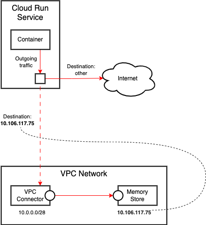

# Accessing Redis Memorystore in a VPC Network

## Use Case

Cloud Run Services run on Google's network. How to access resources in a VPC network, such as Redis MemoryStore, Cloud SQL and VMs, that have private IP addresses? Use **Serverless VPC Connector**.



## Key Points

1. How to create Serverless VPC Connectors & MemoryStore
2. How to configure Cloud Run to use a VPC Connector
3. How to use MemoryStore in your application

## Environment Variables

```bash
GOOGLE_CLOUD_PROJECT=ibcwe-event-layer-f3ccf6d9
REPOSITORY=us-central1-docker.pkg.dev/$GOOGLE_CLOUD_PROJECT/cloud-run-try
```

## Build

```bash
gcloud builds submit --tag $REPOSITORY/redis
```

## GCP Resources

### Enable APIs

```bash
gcloud services enable redis.googleapis.com
gcloud services enable vpcaccess.googleapis.com
```

### MemoryStore Instance

```bash
gcloud redis instances create py-instance \
--tier basic --size 1 --region us-central1
```

Obtain the private IP address and port:
```bash
gcloud redis instances list --region us-central1
```
```text
INSTANCE_NAME  VERSION    REGION       TIER   SIZE_GB  HOST           PORT  NETWORK  RESERVED_IP       STATUS  CREATE_TIME
py-instance    REDIS_6_X  us-central1  BASIC  1        10.106.117.75  6379  default  10.106.117.72/29  READY   2023-08-11T18:37:27
```

### Serverless VPC Connector

```bash
gcloud compute networks vpc-access connectors \
create py-connector --region us-central1 \
--range 10.0.0.0/28
```

Inspect it:
```bash
gcloud compute networks vpc-access connectors describe py-connector \
--region us-central1
```

```text
ipCidrRange: 10.0.0.0/28
machineType: e2-micro
maxInstances: 10
maxThroughput: 1000
minInstances: 2
minThroughput: 200
name: projects/ibcwe-event-layer-f3ccf6d9/locations/us-central1/connectors/py-connector
network: default
state: READY
```
### Cloud Run Service

```bash
gcloud run deploy redis --image $REPOSITORY/redis \
--set-env-vars REDISHOST=10.106.117.75 \
--set-env-vars REDISPORT=6379
```

## Test

```bash
REDIS_URL=$(gcloud run services describe redis --format "value(status.url)")
curl -H "Authorization: Bearer $(gcloud auth print-identity-token)" $REDIS_URL
```

We will get an error:
```text
Error incrementing visitor counter
```

New redeploy the service and specify the VPC Connector.
```bash
gcloud run deploy redis --image $REPOSITORY/redis \
--set-env-vars REDISHOST=10.106.117.75 \
--set-env-vars REDISPORT=6379
--vpc-connector py-connector
```

The test now will succeed.

```bash
REDIS_URL=$(gcloud run services describe redis --format "value(status.url)")
curl -H "Authorization: Bearer $(gcloud auth print-identity-token)" $REDIS_URL
```
```text
Visitor number: 3
```

## Clean up

```bash
gcloud run services delete redis

gcloud artifacts packages delete --repository=cloud-run-try \
--location=us-central1 redis

gcloud compute networks vpc-access connectors delete py-connector \
--region us-central1

gcloud redis instances delete py-instance --region=us-central1
```
<style>
    h1 {
        color: DarkRed;
        text-align: center;
    }
    h2 {
        color: DarkBlue;
    }
    h3 {
        color: DarkGreen;
    }
    h4 {
        color: DarkMagenta;
    }
    strong {
        color: Maroon;
    }
    em {
        color: Maroon;
    }
    img {
        display: block;
        margin-left: auto;
        margin-right: auto
    }
    code {
        color: SlateBlue;
    }
    mark {
        background-color:GoldenRod;
    }
</style>