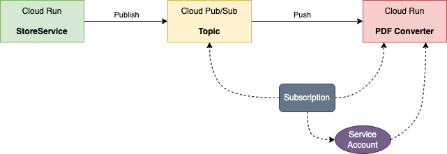

# Cloud Run Service Triggered Another Service using Pub/Sub

## Usecase

The **`StoreService`** places an order into a Pub/Sub topic where a subscription pushes the message to the **`OrderService`**.



This is based on the Google's [Cloud Run Lab](https://www.cloudskillsboost.google/course_sessions/3818505/labs/339690) 

## Key Technology

1. Invoking Cloud Run services via Pub/Sub subscriptions
2. IAM service account and role binding

## Deployment

### Enabling APIs

```bash
gcloud services enable rub.googleapis.com
gcloud services enable pubsub.googleapis.com
```
### Environment Variables

```bash
LOCATION=us-central1
```

### Cloud Run Services

StoreService
```bash
gcloud run deploy store-service \
  --image gcr.io/qwiklabs-resources/gsp724-store-service \
  --region $LOCATION \
  --allow-unauthenticated
```

OrderService
```bash
gcloud run deploy order-service \
  --image gcr.io/qwiklabs-resources/gsp724-order-service \
  --region $LOCATION \
  --no-allow-unauthenticated
```

### Service Account

Create a service account
```bash
gcloud iam service-accounts create pubsub-cloud-run-invoker \
  --display-name "Order Initiator"
```

Bind permissions to the service account
```bash
gcloud run services add-iam-policy-binding order-service --region $LOCATION \
  --member=serviceAccount:pubsub-cloud-run-invoker@$GOOGLE_CLOUD_PROJECT.iam.gserviceaccount.com \
  --role=roles/run.invoker --platform managed
```

Enable project's Pub/Sub service agent to create access tokens
```bash
PROJECT_NUMBER=$(gcloud projects list \
  --filter="qwiklabs-gcp" \
  --format='value(PROJECT_NUMBER)')

gcloud projects add-iam-policy-binding $GOOGLE_CLOUD_PROJECT \
   --member=serviceAccount:service-$PROJECT_NUMBER@gcp-sa-pubsub.iam.gserviceaccount.com \
   --role=roles/iam.serviceAccountTokenCreator
```

### Pub/Sub

Topic
```bash
gcloud pubsub topics create ORDER_PLACED
```

Subscription
```bash
ORDER_SERVICE_URL=$(gcloud run services describe order-service \
   --region $LOCATION \
   --format="value(status.address.url)")

gcloud pubsub subscriptions create order-service-sub \
   --topic ORDER_PLACED \
   --push-endpoint=$ORDER_SERVICE_URL \
   --push-auth-service-account=pubsub-cloud-run-invoker@$GOOGLE_CLOUD_PROJECT.iam.gserviceaccount.com
```

## Testing

```bash
echo '{
 "billing_address": {
   "name": "Kylie Scull",
   "address": "6471 Front Street",
   "city": "Mountain View",
   "state_province": "CA",
   "postal_code": "94043",
   "country": "US"
 },
 "shipping_address": {
   "name": "Kylie Scull",
   "address": "9902 Cambridge Grove",
   "city": "Martinville",
   "state_province": "BC",
   "postal_code": "V1A",
   "country": "Canada"
 },
 "items": [
   {
     "id": "RW134",
     "quantity": 1,
     "sub-total": 12.95
   },
   {
     "id": "IB541",
     "quantity": 2,
     "sub-total": 24.5
   }
 ]
}' > test.json

STORE_SERVICE_URL=$(gcloud run services describe store-service \
   --region $LOCATION \
   --format="value(status.address.url)")

curl -X POST -H "Content-Type: application/json" -d @test.json $STORE_SERVICE_URL
```

The output of the command indicates that an order had been successfully created, and should be similar to:
```json
{"status":"success","order_id":"6pa5mmh"}
```

Go to Google Cloud Console, click **Navigation menu > Cloud Run**.

Click **`store-service`** > **Logs**. Check the store service logs to view the order ID that was generated.

Click **`order-service`** > **Logs**. Check the logs to see the generated order ID that was passwd to order service.

<style>
    h1 {
        color: DarkRed;
        text-align: center;
    }
    h2 {
        color: DarkBlue;
    }
    h3 {
        color: DarkGreen;
    }
    h4 {
        color: DarkMagenta;
    }
    strong {
        color: Maroon;
    }
    em {
        color: Maroon;
    }
    img {
        display: block;
        margin-left: auto;
        margin-right: auto
    }
    code {
        color: SlateBlue;
    }
    mark {
        background-color:GoldenRod;
    }
</style>